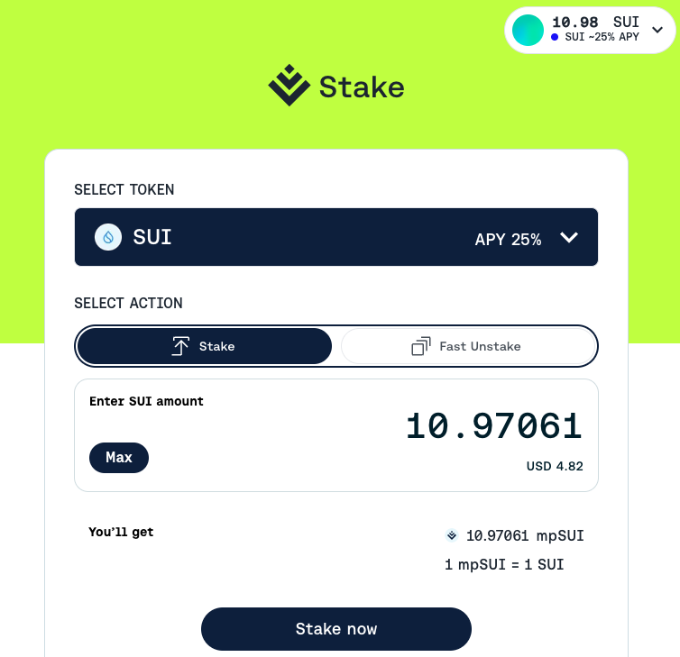

# Meta Pool Staked SUI


## Sui Liquid Staking Hackathon 2023

Welcome to our submission for the Sui Liquid Staking Hackathon! Enclosed in this repository are the contracts for our innovative prototype.

At the heart of our project is the user-friendly interface of Meta Pool, designed to streamline the SUI token staking process. Enthusiasts can easily connect their preferred Sui wallet to Meta Pool and seamlessly stake any desired amount of SUI tokens.

Upon staking, the smart contract mints a special token, termed `mpSui`. This token is more than just a digital asset—it signifies a user's share in the overall staked assets. As such, the value of `mpSui` naturally increases relative to the original Sui tokens and the rewards reaped by validators.

Our ultimate vision is to disseminate all staked Sui among a diverse array of validators, employing the Nakamoto coefficient as a guiding principle. This method underscores our commitment to fortifying the decentralization of the Sui Network.

## Front End Application

The frontend application was developed in the following repository:

https://github.com/Meta-Pool/meta-pool-ui/tree/sui-network

It is available in Sui `devnet` Network in this URL:

https://meta-pool-ui-git-sui-network-metapool.vercel.app/stake?token=sui

And, a glimpse of how it looks:



## Publishing `Testnet`

```
Successfully verified dependencies on-chain against source.
----- Transaction Digest ----
AquesAjP2FeFs2JwhiyUSmfKQcnY2AQuUf3kEL4rifm1
----- Transaction Data ----
Transaction Signature: [Signature(Ed25519SuiSignature(Ed25519SuiSignature([0, 221, 52, 102, 106, 148, 42, 239, 13, 123, 211, 231, 203, 139, 175, 241, 65, 62, 123, 169, 215, 26, 88, 93, 103, 62, 198, 173, 158, 182, 104, 243, 147, 251, 66, 47, 183, 19, 66, 160, 69, 38, 122, 209, 207, 140, 187, 124, 117, 242, 133, 45, 131, 200, 223, 32, 218, 177, 142, 223, 168, 245, 150, 233, 3, 112, 7, 37, 121, 78, 135, 248, 10, 68, 32, 53, 107, 73, 50, 88, 250, 71, 105, 98, 162, 200, 22, 132, 215, 120, 159, 140, 124, 53, 12, 0, 243])))]
Transaction Kind : Programmable
Inputs: [Pure(SuiPureValue { value_type: Some(Address), value: "0x543e835801dea4aeafb76bb7edd5e99d436f94c21de22080a4d98c00f1500453" })]
Commands: [
  Publish(<modules>,0x0000000000000000000000000000000000000000000000000000000000000001,0x0000000000000000000000000000000000000000000000000000000000000002),
  TransferObjects([Result(0)],Input(0)),
]

Sender: 0x543e835801dea4aeafb76bb7edd5e99d436f94c21de22080a4d98c00f1500453
Gas Payment: Object ID: 0x542296ce48077845a6c42174acb8ce94aabaa63564730d95ceb0d64d0bca285a, version: 0xe8e2a, digest: FHtPHyddVF7uJdpc3U9P3r1BpQt4oD9w2p5SqMT5gDP3
Gas Owner: 0x543e835801dea4aeafb76bb7edd5e99d436f94c21de22080a4d98c00f1500453
Gas Price: 1000
Gas Budget: 20000000

----- Transaction Effects ----
Status : Success
Created Objects:
  - ID: 0x019ecb78fb4f75b11fc50e22f5125b80cb77b6644c74f72beb73b3122e60fecd , Owner: Immutable
  - ID: 0x0aa52cbca194b40ec5e93fcbad9f307516944cdd12942558b3bbaea39dcdbda8 , Owner: Shared
  - ID: 0x61293e76a46368630c094ef8e9dc75bc9381971b597d764795d40a75f4d986a3 , Owner: Account Address ( 0x543e835801dea4aeafb76bb7edd5e99d436f94c21de22080a4d98c00f1500453 )
Mutated Objects:
  - ID: 0x542296ce48077845a6c42174acb8ce94aabaa63564730d95ceb0d64d0bca285a , Owner: Account Address ( 0x543e835801dea4aeafb76bb7edd5e99d436f94c21de22080a4d98c00f1500453 )

----- Events ----
Array []
----- Object changes ----
Array [
    Object {
        "type": String("mutated"),
        "sender": String("0x543e835801dea4aeafb76bb7edd5e99d436f94c21de22080a4d98c00f1500453"),
        "owner": Object {
            "AddressOwner": String("0x543e835801dea4aeafb76bb7edd5e99d436f94c21de22080a4d98c00f1500453"),
        },
        "objectType": String("0x2::coin::Coin<0x2::sui::SUI>"),
        "objectId": String("0x542296ce48077845a6c42174acb8ce94aabaa63564730d95ceb0d64d0bca285a"),
        "version": String("953899"),
        "previousVersion": String("953898"),
        "digest": String("59aVMyifDXNK7ZkxUoYirsnJ2dYsNYA2TdNs5ahyLV3g"),
    },
    Object {
        "type": String("published"),
        "packageId": String("0x019ecb78fb4f75b11fc50e22f5125b80cb77b6644c74f72beb73b3122e60fecd"),
        "version": String("1"),
        "digest": String("3gWaDjnqsjVij233nu2fNCnpLkLjVdXjicXFGgFNazfy"),
        "modules": Array [
            String("mpsui"),
        ],
    },
    Object {
        "type": String("created"),
        "sender": String("0x543e835801dea4aeafb76bb7edd5e99d436f94c21de22080a4d98c00f1500453"),
        "owner": Object {
            "Shared": Object {
                "initial_shared_version": Number(953899),
            },
        },
        "objectType": String("0x019ecb78fb4f75b11fc50e22f5125b80cb77b6644c74f72beb73b3122e60fecd::mpsui::StakingPool"),
        "objectId": String("0x0aa52cbca194b40ec5e93fcbad9f307516944cdd12942558b3bbaea39dcdbda8"),
        "version": String("953899"),
        "digest": String("B668fgQ2bTqmjdBLQtjktZP2FH1DZZEuWdWJQSdo3Bcr"),
    },
    Object {
        "type": String("created"),
        "sender": String("0x543e835801dea4aeafb76bb7edd5e99d436f94c21de22080a4d98c00f1500453"),
        "owner": Object {
            "AddressOwner": String("0x543e835801dea4aeafb76bb7edd5e99d436f94c21de22080a4d98c00f1500453"),
        },
        "objectType": String("0x2::package::UpgradeCap"),
        "objectId": String("0x61293e76a46368630c094ef8e9dc75bc9381971b597d764795d40a75f4d986a3"),
        "version": String("953899"),
        "digest": String("6iB643yRzbJReFHJDh623XGuGhTTuDt5zEWKnZVgef98"),
    },
]
----- Balance changes ----
Array [
    Object {
        "owner": Object {
            "AddressOwner": String("0x543e835801dea4aeafb76bb7edd5e99d436f94c21de22080a4d98c00f1500453"),
        },
        "coinType": String("0x2::sui::SUI"),
        "amount": String("-14895080"),
    },
]
```

## Publishing `Devnet`

```
----- Transaction Digest ----
A7qTVQepGBAXLZJn7ZA8ppfEgruHCTtTChX8HRx2nMCQ
----- Transaction Data ----
Transaction Signature: [Signature(Ed25519SuiSignature(Ed25519SuiSignature([0, 208, 47, 189, 69, 33, 19, 191, 101, 175, 5, 90, 99, 195, 2, 98, 125, 231, 13, 129, 71, 13, 191, 193, 243, 159, 216, 14, 129, 212, 45, 134, 179, 118, 55, 125, 80, 53, 48, 179, 35, 131, 221, 238, 100, 185, 79, 133, 211, 133, 5, 201, 99, 43, 62, 142, 0, 103, 228, 186, 215, 250, 146, 139, 10, 112, 7, 37, 121, 78, 135, 248, 10, 68, 32, 53, 107, 73, 50, 88, 250, 71, 105, 98, 162, 200, 22, 132, 215, 120, 159, 140, 124, 53, 12, 0, 243])))]
Transaction Kind : Programmable
Inputs: [Pure(SuiPureValue { value_type: Some(Address), value: "0x543e835801dea4aeafb76bb7edd5e99d436f94c21de22080a4d98c00f1500453" })]
Commands: [
  Publish(<modules>,0x0000000000000000000000000000000000000000000000000000000000000001,0x0000000000000000000000000000000000000000000000000000000000000002),
  TransferObjects([Result(0)],Input(0)),
]

Sender: 0x543e835801dea4aeafb76bb7edd5e99d436f94c21de22080a4d98c00f1500453
Gas Payment: Object ID: 0xb87f172a5926b60e41edd24a9871e54b1ff1438921a7595e7b1efd973d60e0c8, version: 0x3, digest: Gi4bTrWeRdYCunmc21KujPR9gTLdpzAG1uKUmEasNaLb
Gas Owner: 0x543e835801dea4aeafb76bb7edd5e99d436f94c21de22080a4d98c00f1500453
Gas Price: 1000
Gas Budget: 20000000

----- Transaction Effects ----
Status : Success
Created Objects:
  - ID: 0x81b24924ef30c74d9c9b419612126c8b7d19bbace5096369aae0045d07cc43a3 , Owner: Shared
  - ID: 0xb941db64ee0fda07adebdc7a9c91323562d8b2963af518ea69defc9976137fc4 , Owner: Account Address ( 0x543e835801dea4aeafb76bb7edd5e99d436f94c21de22080a4d98c00f1500453 )
  - ID: 0xbc33e19b01426ddb110d990d328d7b7951e4d4be1bdefd5ffef0a437eb216b7c , Owner: Immutable
Mutated Objects:
  - ID: 0xb87f172a5926b60e41edd24a9871e54b1ff1438921a7595e7b1efd973d60e0c8 , Owner: Account Address ( 0x543e835801dea4aeafb76bb7edd5e99d436f94c21de22080a4d98c00f1500453 )

----- Events ----
Array []
----- Object changes ----
Array [
    Object {
        "type": String("mutated"),
        "sender": String("0x543e835801dea4aeafb76bb7edd5e99d436f94c21de22080a4d98c00f1500453"),
        "owner": Object {
            "AddressOwner": String("0x543e835801dea4aeafb76bb7edd5e99d436f94c21de22080a4d98c00f1500453"),
        },
        "objectType": String("0x2::coin::Coin<0x2::sui::SUI>"),
        "objectId": String("0xb87f172a5926b60e41edd24a9871e54b1ff1438921a7595e7b1efd973d60e0c8"),
        "version": String("4"),
        "previousVersion": String("3"),
        "digest": String("CBjx7sBrCCRG9518udBnAY3QKsTtCYXQvy7c1jyLb4Mq"),
    },
    Object {
        "type": String("created"),
        "sender": String("0x543e835801dea4aeafb76bb7edd5e99d436f94c21de22080a4d98c00f1500453"),
        "owner": Object {
            "Shared": Object {
                "initial_shared_version": Number(4),
            },
        },
        "objectType": String("0xbc33e19b01426ddb110d990d328d7b7951e4d4be1bdefd5ffef0a437eb216b7c::mpsui::StakingPool"),
        "objectId": String("0x81b24924ef30c74d9c9b419612126c8b7d19bbace5096369aae0045d07cc43a3"),
        "version": String("4"),
        "digest": String("Ag84P5bFjERiCMU9gncWxQitV45bLm7VBm7Bjn6ZTeYo"),
    },
    Object {
        "type": String("created"),
        "sender": String("0x543e835801dea4aeafb76bb7edd5e99d436f94c21de22080a4d98c00f1500453"),
        "owner": Object {
            "AddressOwner": String("0x543e835801dea4aeafb76bb7edd5e99d436f94c21de22080a4d98c00f1500453"),
        },
        "objectType": String("0x2::package::UpgradeCap"),
        "objectId": String("0xb941db64ee0fda07adebdc7a9c91323562d8b2963af518ea69defc9976137fc4"),
        "version": String("4"),
        "digest": String("8gTjd6kPa1tNTvDjGay5D3DP36qfnZWqeVj4rv4spCzP"),
    },
    Object {
        "type": String("published"),
        "packageId": String("0xbc33e19b01426ddb110d990d328d7b7951e4d4be1bdefd5ffef0a437eb216b7c"),
        "version": String("1"),
        "digest": String("ArqRRwiaNewCUbj3ibiCAhDGcAuXR8yCFia1fHwQDUMx"),
        "modules": Array [
            String("mpsui"),
        ],
    },
]
----- Balance changes ----
Array [
    Object {
        "owner": Object {
            "AddressOwner": String("0x543e835801dea4aeafb76bb7edd5e99d436f94c21de22080a4d98c00f1500453"),
        },
        "coinType": String("0x2::sui::SUI"),
        "amount": String("-14895080"),
    },
]
```

## Useful Commands

The address and connected network:
```
keystore:
  File: /Users/jomsox/.sui/sui_config/sui.keystore
envs:
  - alias: devnet
    rpc: "https://fullnode.devnet.sui.io:443"
    ws: ~
  - alias: testnet
    rpc: "https://sui-testnet-rpc.allthatnode.com:443"
    ws: ~
active_env: devnet
active_address: "0x543e835801dea4aeafb76bb7edd5e99d436f94c21de22080a4d98c00f1500453"
```

Useful `Sui` client commands:

```
// FAUCET
curl --location --request POST 'https://faucet.devnet.sui.io/gas' \
--header 'Content-Type: application/json' \
--data-raw '{
    "FixedAmountRequest": {
        "recipient": "0x543e835801dea4aeafb76bb7edd5e99d436f94c21de22080a4d98c00f1500453"
    }
}'

// VIEW CURRENT WALLET ADDRESS
sui client addresses                // list all addresses
sui client switch --address 0xa3c00467938b392a12355397bdd3d319cea5c9b8f4fc9c51b46b8e15a807f030

sui client active-address

// NEW WALLET ADDRESS
sui client new-address ed25519

// NEW PROJECT
sui move new erc20

// BUILD
sui move build

// DEPLOY
sui client publish --gas-budget <gas_budget> [absolute file path to the package that needs to be published]
sui client publish --gas-budget 20000000 .

// CALL FUNCTION

sui client call --function transfer --module sui --package 0x2 --args 0x1b9c00a93345ce5f12bea9ffe04748d6696c30631735193aea95b8f9082c1062 0x33e3e1d64f76b71a80ec4f332f4d1a6742c537f2bb32473b01b1dcb1caac9427 --gas-budget 1000

sui client call --function deposit --module mpsui --package 0xbc33e19b01426ddb110d990d328d7b7951e4d4be1bdefd5ffef0a437eb216b7c --args 0x81b24924ef30c74d9c9b419612126c8b7d19bbace5096369aae0045d07cc43a3 0x2::coin::Coin<20000> --gas-budget 20000000

sui client call --function deposit --module mpsui --package 0xbc33e19b01426ddb110d990d328d7b7951e4d4be1bdefd5ffef0a437eb216b7c --args '["0x81b24924ef30c74d9c9b419612126c8b7d19bbace5096369aae0045d07cc43a3","20000000"]' --gas-budget 20000000

```
